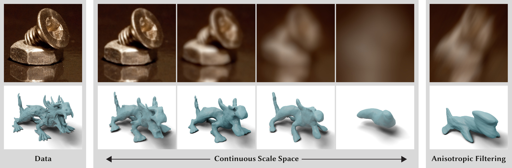

# Neural Gaussian Scale-Space Fields

This is the Python reference implementation of our paper
"[Neural Gaussian Scale-Space Fields](https://neural-gaussian-scale-space-fields.mpi-inf.mpg.de)".

Gaussian scale spaces are a cornerstone of signal representation and processing, with applications in filtering,
multiscale analysis, anti-aliasing, and many more. However, obtaining such a scale space is costly and cumbersome, in
particular for continuous representations such as neural fields. We present an efficient and lightweight method to learn
the fully continuous, anisotropic Gaussian scale space of an arbitrary signal. Based on Fourier feature modulation and
Lipschitz bounding, our approach is trained self-supervised, i.e., training does not require any manual filtering. Our
neural Gaussian scale-space fields faithfully capture multiscale representations across a broad range of modalities, and
support a diverse set of applications. These include images, geometry, light-stage data, texture anti-aliasing, and
multiscale optimization.

Please cite our paper if you refer to our results or use the method or code in your own work:

    @article{mujkanovic2024ngssf,
      title = {Neural Gaussian Scale-Space Fields},
      author = {Felix Mujkanovic and Ntumba Elie Nsampi and Christian Theobalt and Hans-Peter Seidel and Thomas Leimk{\"u}hler},
      journal = {ACM Transactions on Graphics},
      year = {2024},
      volume = {43},
      number = {4}
    }

## Core Method

While the `ngssf/` and `scripts/` folders collect everything needed to reproduce all our experiments, they might be hard
to parse if you just want to understand or use the method. For that case, we provide a compact standalone implementation
of our core method in [`self_contained_demo.py`](self_contained_demo.py). The following libraries are required:

    pip install imageio scipy torch tqdm

Then run the script to train our field and have it smooth a tasty image!

    python self_contained_demo.py

## Reproducing Our Experiments

We tested our codebase against Python 3.12, though other versions likely work fine. Create a new virtualenv and then
install our package:

    cd /path/to/neural-gaussian-scale-space-fields
    pip install -e .

Next, download the [dataset](https://neural-gaussian-scale-space-fields.mpi-inf.mpg.de/data.zip) and extract it into the
repository such that, e.g., the folder `/data/picture` exists.

### Step 1: Train

Use the [`train.py`](scripts/train.py) script to train our field on various modalities:

    python scripts/train.py neural picture
    python scripts/train.py neural mesh
    python scripts/train.py neural textured     # Neural texture
    python scripts/train.py neural lightstage
    python scripts/train.py neural testfunc     # Ackley function

The above calls train fields for *each* picture, mesh etc. To only train one field, specify the data item's name as the
third argument. Look in the `data/` folder for all available names. Notice that this also works for the other scripts.

    python scripts/train.py neural picture bbq
    python scripts/train.py neural mesh armadillo

### Step 2: Calibrate

Use the [`calibrate.py`](scripts/calibrate.py) script to run our post-training calibration:

    python scripts/calibrate.py neural picture [name]
    python scripts/calibrate.py neural mesh [name]
    python scripts/calibrate.py neural textured

### Step 3: Benchmark

Use the [`benchmark.py`](scripts/benchmark.py) script to have the neural fields predict (an)isotropically smoothed
versions of pictures and meshes at various scales:

    python scripts/benchmark.py neural picture [name]
    python scripts/benchmark.py neural mesh [name]

Also use this script to generate smoothed ground truths via Monte Carlo convolution:

    python scripts/benchmark.py gauss picture [name]
    python scripts/benchmark.py gauss mesh [name]

### Step 4: Metrics

Use the [`metrics.py`](scripts/metrics.py) script to compare the output of our field with the ground truth:

    python scripts/metrics.py neural picture [name]
    python scripts/metrics.py neural mesh [name]

Finally, accumulate the results using the [`metrics_summary.py`](scripts/metrics_summary.py) script:

    python scripts/metrics_summary.py neural picture variance_benchmark
    python scripts/metrics_summary.py neural picture covariance_matrix_benchmark
    python scripts/metrics_summary.py neural mesh variance_benchmark
    python scripts/metrics_summary.py neural mesh covariance_matrix_benchmark

Numbers very similar to those found in Tables 1-4 in our paper should now be available in `results/metrics/`.

### Step 5: Visualize

Use the [`visualize.py`](scripts/visualize.py) script to get the images, videos, and meshes from our paper and website:

    python scripts/visualize.py picture_isotropic
    python scripts/visualize.py picture_anisotropic
    python scripts/visualize.py picture_foveation
    python scripts/visualize.py mesh_isotropic
    python scripts/visualize.py mesh_anisotropic
    python scripts/visualize.py lightstage
    python scripts/visualize.py picture_video
    python scripts/visualize.py mesh_video_objects
    python scripts/visualize.py mesh_video_ellipsoids
    python scripts/visualize.py lightstage_video

### Ablations

To reproduce our ablations, perform the above four above steps with `neural` replaced by one of the following:

| Configuration as in the paper | Script equivalent                       |
|-------------------------------|-----------------------------------------|
| w/o Sobol                     | `neural_ablation_whitenoisefreqs`       |
| w/o Freq. Warping             | `neural_ablation_uniformfreqlens`       |
| Freq. Scaling Only            | `neural_ablation_nolipschitznoscaling`  |
| w/o Lipschitz                 | `neural_ablation_nolipschitz`           |
| 10-Lipschitz                  | `neural_ablation_looselipschitz`        |
| Spectral Norm.                | `neural_ablation_spectralnormalization` |
| l1-Loss                       | `neural_ablation_maeloss`               |

### Neural Texture

First install the required additional dependencies:

    pip install -e .[neural-texture]

Open the 3D renderer window using the [`textured_render_uv.py`](scripts/textured_render_uv.py) script. Press ESC to
quit, W/A/S/D/SPACE/SHIFT to move, and use the mouse to look around. You will see the mesh of a fish, but instead of a
texture, it is covered in UV coordinates. If you feel dizzy, set `gizmo_and_grid` in the script to true to render a
gizmo and a base plane grid. Find a nice camera path and press R to start/stop recording a frame sequence.

    python scripts/textured_render_uv.py

Now use the [`textured_apply_neural_texture.py`](scripts/textured_apply_neural_texture.py) script to apply the neural
texture to the fish in each frame of the sequence. To compare with multisampling, we used `16` as the downsampling
factor here and increased the window size in `textured_render_uv.py` to still get a large enough image, but to just
demonstrate our method, you can replace `16` with `1`:

    python scripts/textured_apply_neural_texture.py moving 16
